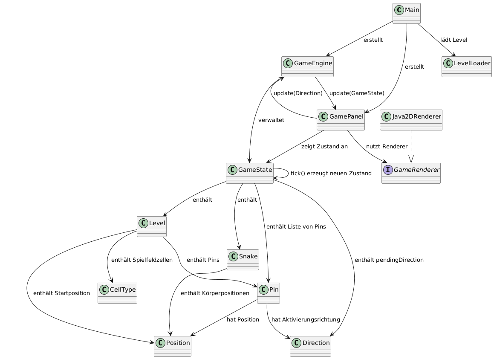

<!-- pandoc -s -f markdown -t markdown --columns=94 --reference-links=true README.md -->

## About

This represents the student support code for the [LockSnake task].

## UML-Klassendiagramm

Das folgende Diagramm zeigt die wichtigsten Klassen und Beziehungen fuer Aufgabe 2.1.

## License

This [work] by [Carsten Gips] and [contributors] is licensed under [MIT].

  [LockSnake task]: https://github.com/Programmiermethoden-CampusMinden/Prog2-Lecture/tree/master/homework
  [work]: https://github.com/Programmiermethoden-CampusMinden/prog2_ybel_locksnake
  [Carsten Gips]: https://github.com/cagix
  [contributors]: https://github.com/Programmiermethoden-CampusMinden/prog2_ybel_locksnake/graphs/contributors
  [MIT]: LICENSE.md
